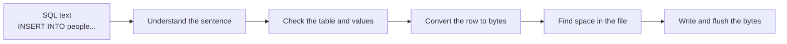
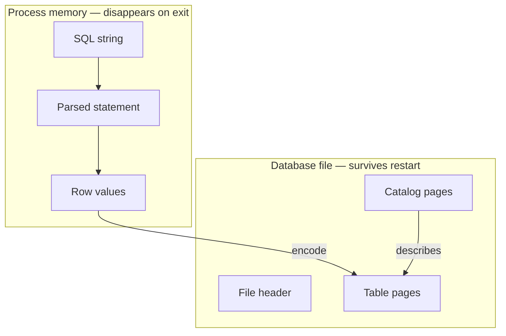
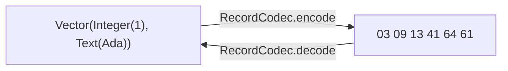
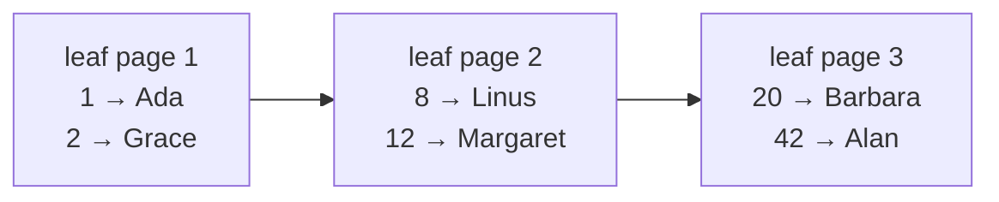
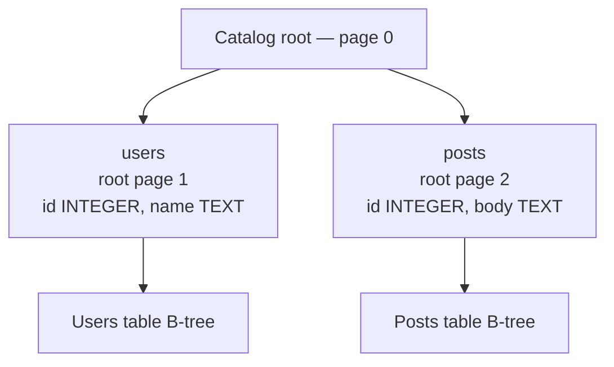
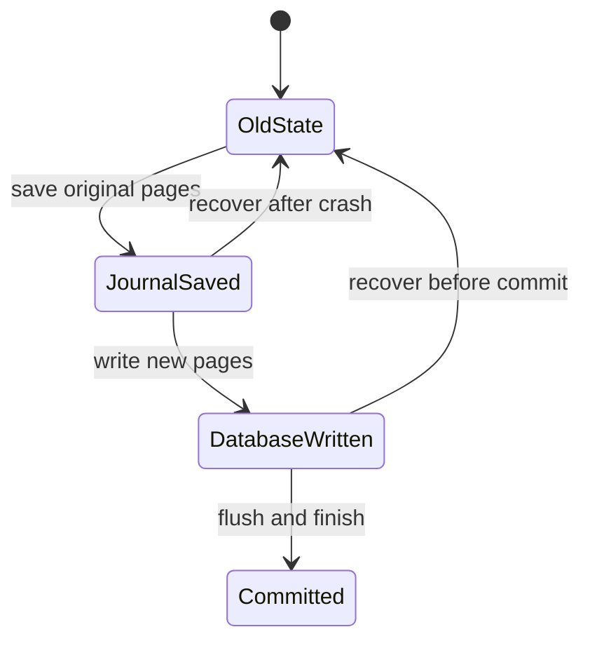
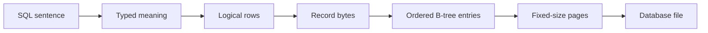

# 0. Database Foundations — No Prior Internals Knowledge Required

This chapter gives you the vocabulary used by the rest of the book. You only need to know how to
run a command and read basic Scala. You do **not** need prior compiler, filesystem, or B-tree
knowledge.

## Start with one familiar action

Imagine an address book. You type:

```sql
INSERT INTO people VALUES (1, 'Ada');
```

You expect the row to remain after the application exits. A database turns that expectation into
smaller jobs:



Every part of this book implements one box in that diagram.

## Table, column, row, and schema

A **table** is a named collection of similarly shaped items. A **column** describes one position in
that shape. A **row** is one item.

```text
table: people

┌──────────── column: id
│  ┌───────── column: name
▼  ▼
1  Ada        ◄── row
2  Grace      ◄── row
```

The column definitions form the table's **schema**:

```sql
CREATE TABLE people (
  id INTEGER NOT NULL,
  name TEXT NOT NULL
);
```

`NOT NULL` is a **constraint**: it rejects a row with no value for that column.

## Memory is not a file

Program memory is convenient but temporary. A file survives process exit.



**Persistent** means represented outside temporary memory so data can be loaded again. **Durable**
is stronger: after a successful commit, data must survive specified failures. This project already
persists normal close/reopen cycles. Crash durability arrives with transactions.

## Why SQL needs a parser

The computer first sees characters. It does not automatically know that `people` is a table name.

```text
Characters: I N S E R T   I N T O   p e o p l e ...
Tokens:     INSERT | INTO | people | VALUES | ( | 1 | , | 'Ada' | )
Structure:  Insert(table = people, rows = [[1, "Ada"]])
```

A **lexer** groups characters into tokens. A **parser** checks their order and builds an **abstract
syntax tree** (AST). Despite the name, the result is ordinary nested data:

```scala
Statement.Insert(
  table = Identifier("people"),
  columns = Vector.empty,
  rows = Vector(Vector(Expr.Value(Integer(1)), Expr.Value(Text("Ada"))))
)
```

## Values are not yet bytes

Inside the engine, `Ada` is a logical value such as `Value.Text("Ada")`. A file stores bytes.
**Serialization** converts values to bytes; **deserialization** reverses it.



A **codec** is simply a pair of encode/decode rules. Stored bytes include type information so the
decoder knows whether `41 64 61` is text, a number, or arbitrary binary data.

## Why divide a file into pages?

Rewriting the whole file for every row would be wasteful. Databases divide files into fixed-size
blocks called **pages**. Our default page is 4096 bytes.

```text
database file
┌──────────────┬──────────────┬──────────────┬──────────────┐
│ file header  │ page 0       │ page 1       │ page 2       │
│ format info  │ catalog tree │ people tree  │ more rows    │
└──────────────┴──────────────┴──────────────┴──────────────┘
```

A **page id** is the page's number. A **pager** translates page ids into file offsets and reads or
writes exactly one page. Higher layers never calculate file offsets themselves.

## Why rows need an ordered tree

If rows were appended without structure, finding row 42 might require checking every row. A
**B-tree** keeps keys ordered and groups many entries per page. We begin with linked leaf pages:



A **key** orders an entry. Table B-trees use a numeric **rowid** as the key. A **payload** is the
record bytes beside it. A **leaf** stores actual entries. Later, **interior pages** point toward
other pages so lookup can skip irrelevant leaves.

## How does the database remember its tables?

The database needs data about its own data: table names, columns, and root pages. This is
**metadata**. The table holding metadata is the **catalog**.



When reopening a file, the database reads the catalog first. It tells the engine where every table
begins and how to interpret each row.

## What does atomic mean?

If one statement inserts three rows and the second is invalid, we want all three or none. An
operation that appears indivisible is **atomic**.

Semantic validation before writing prevents known-invalid prefixes. A crash during file writes is
harder. A **rollback journal** saves original pages so recovery can restore the old state.



## Scala vocabulary used in the book

| Scala form | Read it as | Why we use it |
|---|---|---|
| `enum Value` | one of several closed cases | a value is NULL, integer, real, text, or blob |
| `case class Row(...)` | immutable named data | easy to construct and compare in tests |
| `Vector[A]` | ordered immutable sequence of A | column and row order stays stable |
| `Option[A]` | zero or one A | a lookup may find nothing |
| `Either[E, A]` | error E or success A | invalid SQL and bytes are expected outcomes |
| opaque `PageId` | an Int with safer meaning | avoids mixing page ids with other integers |
| pattern matching | handle each possible shape | the compiler checks enum coverage |

Read this code:

```scala
RecordCodec.decode(bytes).flatMap(values => Row.checked(schema, values))
```

as: “decode the bytes; if successful, validate the values as a row; otherwise preserve the first
error.”

## The mental model to keep



You do not need to memorize the implementation. The following chapters revisit every arrow, build
it in isolation, test it, and connect it to the complete path.
