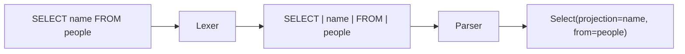

# 1. SQL as a language

> New words: **token**, **lexer**, **parser**, **AST**, and **source position**. If any are unfamiliar,
> read [Database Foundations](00-database-foundations.md) first.

SQL text should become typed data before it touches storage. We follow the same
broad pipeline described by SQLite's [architecture document][architecture]:
tokenize, parse, plan, then execute.



The lexer answers “where does each word or symbol end?” The parser answers “does this sequence have
a valid SQL shape?” Keeping them separate makes both jobs smaller.

The first implementation milestone introduces a total lexer (every character
is either a token or a located error), an immutable AST, and a recursive-descent
parser. Scala 3 enums model closed vocabularies; opaque types prevent accidental
mixing of identifiers and arbitrary strings; `Either` keeps syntax failures in
the ordinary control flow.

```scala
enum Statement:
  case CreateTable(name: Identifier, columns: Vector[ColumnDefinition])
  case Insert(table: Identifier, columns: Vector[Identifier], rows: Vector[Vector[Expr]])
  case Select(projection: Vector[SelectItem], from: Identifier, where: Option[Expr])
```

Keep source positions on tokens. A parser error that says `expected ')' at
line 3, column 9` is useful; one that says only `invalid SQL` is not.

```text
SELECT name FROM
                ▲
                expected identifier at line 1, column 17
```

[architecture]: https://www.sqlite.org/arch.html
