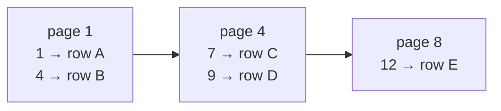
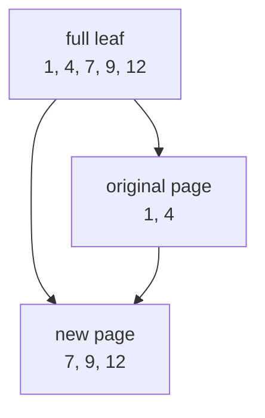

# 4. B-trees

> New words: **key**, **payload**, **cell**, **leaf**, **interior node**, **root**, and **split**.

SQLite stores tables and indexes in B-trees; see [B-tree pages][btree]. A leaf
contains ordered key/value cells. When it fills, split around the median and
insert a separator into its parent. Interior nodes contain separators and child
page numbers.

Start with a sorted leaf. Each arrow means “the next leaf page.”

When a page has no room for another cell, split its ordered entries around the middle:

The implementation starts with a table B-tree keyed by a monotonically assigned
64-bit row id. Property-oriented tests insert keys in awkward orders, reopen the
file, and assert that scans remain sorted.

This chapter's current implementation is a linked leaf level, not yet a complete logarithmic
B-tree. Interior pages will later route a key directly to the correct leaf.

[btree]: https://www.sqlite.org/fileformat.html#b_tree_pages
