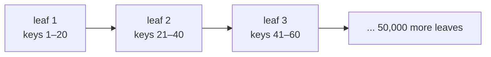
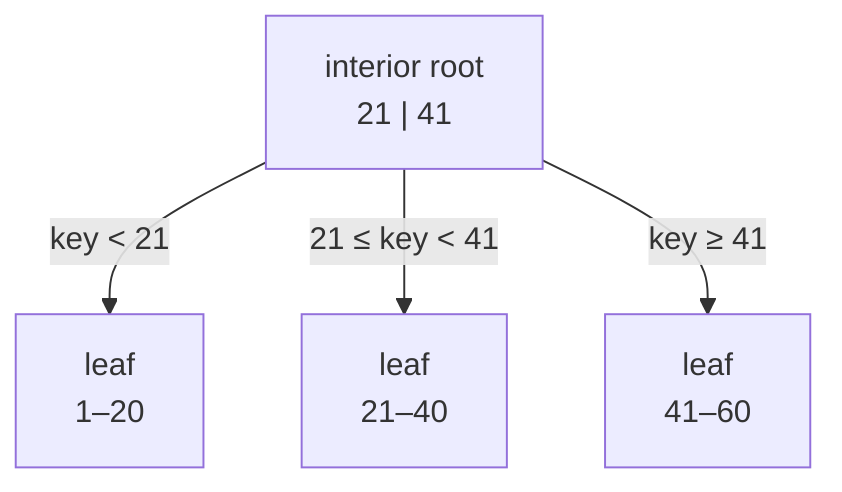
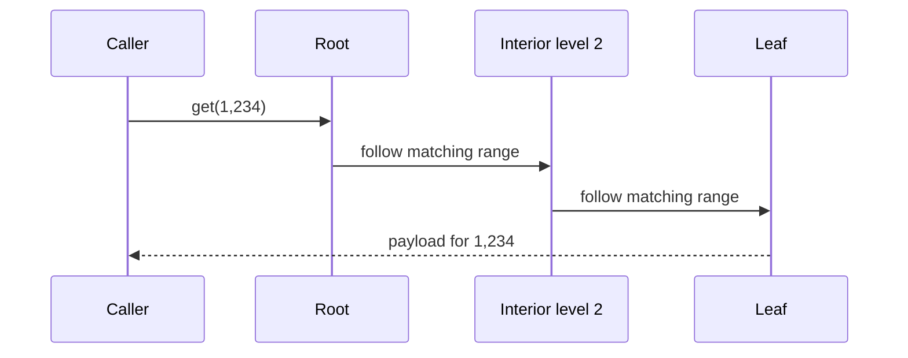
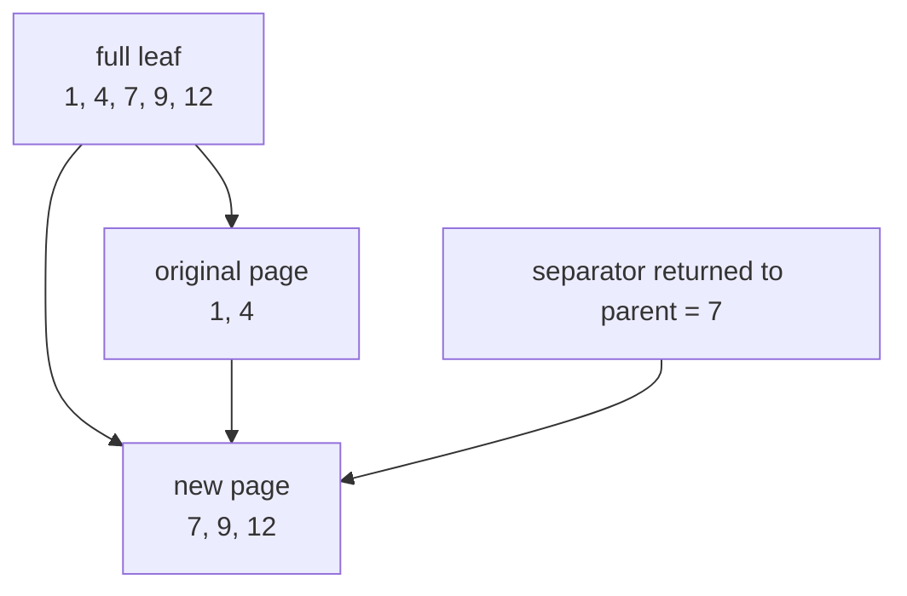
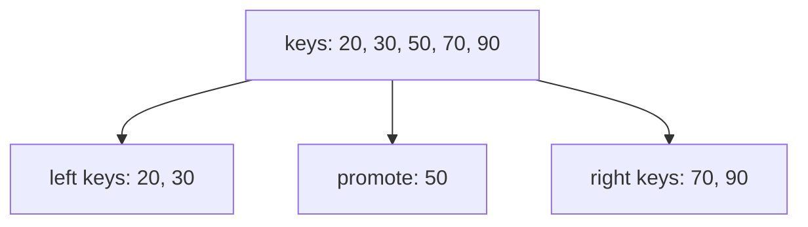
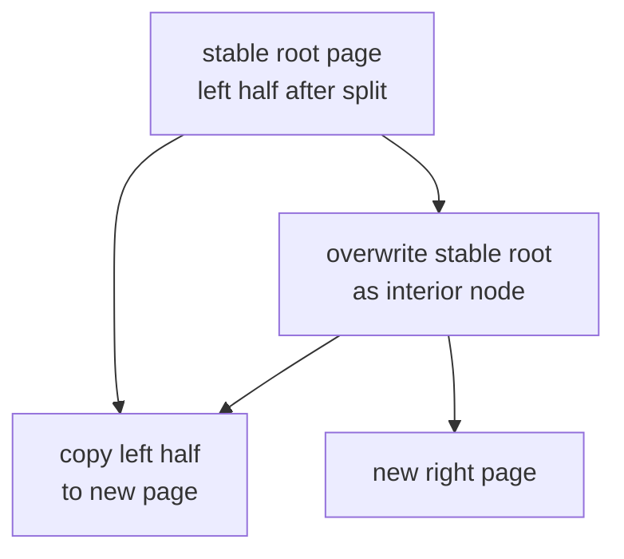
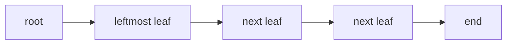

# 4. Building a Multi-Level B+tree

> New words: **key**, **payload**, **cell**, **leaf**, **interior page**, **root**, **separator**,
> **fan-out**, and **split propagation**. Start with [Database Foundations](00-database-foundations.md)
> if these are unfamiliar.

## The problem with a list of pages

Our first storage structure linked leaf pages from left to right:



Scanning is efficient because rows are already ordered. Lookup is not: finding a key near the end
must visit every preceding leaf. If there are `n` leaf pages, worst-case work is proportional to
`n`.

A B+tree adds routing pages above leaves. Each routing decision skips whole ranges.



With many children per interior page, tree height grows slowly. This number of children is called
**fan-out**.

## B-tree versus B+tree

Terminology varies. This implementation is a B+tree:

- actual row payloads exist only in leaves;
- interior pages contain routing keys and child page ids;
- leaves remain linked for ordered scans;
- every lookup ends at a leaf.

SQLite calls its structures B-trees, but table interior pages likewise route toward table leaf
pages. See [B-tree Pages](https://www.sqlite.org/fileformat.html#b_tree_pages).

## Two page shapes

Scala models both shapes as a closed sum type:

```scala
sealed trait Node

final case class Leaf(
  entries: Vector[(Long, Array[Byte])],
  next: Option[PageId]
) extends Node

final case class Interior(
  keys: Vector[Long],
  children: Vector[PageId]
) extends Node
```

An interior node always has one more child than separator keys:

```text
children:  C0       C1       C2       C3
keys:          K0       K1       K2
ranges:    < K0   K0..K1  K1..K2   >= K2
```

The constructor checks `children.size == keys.size + 1`. Invalid structure cannot be represented
without failing immediately.

## Separator meaning

Each separator is the smallest key reachable through its right child. To find a child for key `k`,
choose the first separator greater than `k`. If none is greater, choose the last child.

```scala
def childIndex(key: Long): Int =
  keys.indexWhere(key < _) match
    case -1    => keys.size
    case index => index
```

For keys `[21, 41]`:

| Search key | First greater separator | Child |
|---:|---:|---:|
| 5 | 21 | 0 |
| 21 | 41 | 1 |
| 40 | 41 | 1 |
| 41 | none | 2 |
| 99 | none | 2 |

Boundary equality is worth testing. Using `<=` in the wrong place sends a separator key to the
left page even though the matching row lives on the right.

## Lookup by recursive descent



The code has two cases:

```scala
read(pageId).flatMap:
  case leaf: Leaf         => search leaf entries
  case node: Interior     => find(node.childFor(key), key)
```

If height is `h`, lookup reads roughly `h` pages instead of every leaf.

## Leaf insertion

Insertion first descends to the target leaf. Duplicate rowids are rejected. Otherwise, append the
new entry, sort by key, and check encoded size—not merely entry count. Payloads have different
lengths, so “ten entries per page” is not a valid capacity rule.

```text
before: 1, 4, 9
insert:       7
sorted: 1, 4, 7, 9
```

If the updated leaf fits, write it and stop. If it does not fit, split around the middle.

## Splitting a leaf



The original page keeps the left half. A new page receives the right half and the old `next` link.
The original page's `next` now points at the new right page. Returning the right page's first key
lets the parent route future searches correctly.

The returned value is explicit data:

```scala
final case class Split(separator: Long, right: PageId)
```

No global “last split” variable is needed, so recursive insertion remains locally understandable.

## Propagating a child split

Suppose child `C1` splits and returns `(separator = 30, right = C1b)`:

```text
before
children: C0       C1       C2
keys:         20       50

after
children: C0       C1       C1b      C2
keys:         20       30        50
```

The new separator is inserted at the old child's index. The new right child is inserted one
position later. If the expanded interior page fits, write it and stop.

## Splitting an interior page

An overflowing interior page also splits, but its middle key moves **up** rather than remaining in
either child.



Children split at `middle + 1`, preserving the “one more child than keys” invariant:

```scala
val left  = Interior(keys.take(middle), children.take(middle + 1))
val right = Interior(keys.drop(middle + 1), children.drop(middle + 1))
val promoted = keys(middle)
```

The parent handles the returned `Split` exactly as it handled a leaf split. That is split
propagation: one recursive protocol works at every level.

## Growing a stable root

Catalog entries store a root page id. Changing that id after a root split would require updating
catalog metadata in the same operation. Instead, keep the public root stable:



Algorithm:

1. recursively split the current root, leaving its left half at the root id;
2. allocate a page and copy those left-half bytes into it;
3. overwrite the stable root as an interior page;
4. point it at the copied left page and returned right page.

Tree height increases by one without changing the catalog.

## Ordered scan

For a full scan, routing through every interior node would add unnecessary work. Descend through
the first child until reaching the leftmost leaf, then follow `next` links.



Returned payload arrays are cloned. Otherwise, a caller could mutate bytes stored in the tree
without performing a database write.

## Page encoding

Private page kinds mirror SQLite's conceptual distinction:

```text
leaf page
┌──────┬───────────┬───────┬─────────────────────────────┐
│ kind │ next page │ count │ key | length | payload ...  │
└──────┴───────────┴───────┴─────────────────────────────┘

interior page
┌──────┬───────┬─────────────┬────────────────────────────┐
│ kind │ count │ first child │ separator | child ...      │
└──────┴───────┴─────────────┴────────────────────────────┘
```

Decoding rejects unknown page kinds, negative counts, truncated cells, invalid payload lengths,
and non-increasing keys.

## Payloads larger than a page

A single payload that cannot fit in a leaf uses a local prefix plus overflow-page chain. Chapter
[13. Storing Large Records with Overflow Pages](13-overflow-pages.md) implements allocation,
reconstruction, corruption checks, rollback, and large SQL TEXT integration.

## Declarative deep-tree tests

Small tests rarely split an interior page. The suite inserts 1,500 keys with 512-byte pages under
three orders:

| Order | Bug class it stresses |
|---|---|
| ascending | repeated right-edge splits |
| descending | repeated left-edge splits |
| alternating low/high | separators inserted across the parent |

For every order, tests assert:

- more than 100 pages were allocated, forcing interior splits;
- scan returns exactly keys 1 through 1,500;
- boundary and middle lookups return the payload;
- close/reopen preserves scan and lookup;
- oversized payload rejection does not change page count.

Run the focused suite:

```sh
scala-cli test . --test-only learnsqlite.storage.TableBTreeSuite
```

## Remaining work

The tree now has logarithmic lookup and recursive split propagation. It still lacks:

- cell-level deletion and sibling rebalancing (full replacement does reclaim pages);
- index B-trees with composite encoded keys;
- SQLite's exact cell pointer and payload fraction format;
- page-cache pinning and cursor-safe concurrent mutation.

Track those items in the [Coverage Audit](coverage.md).
