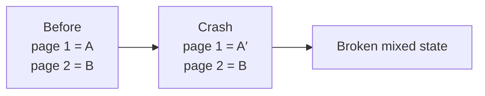
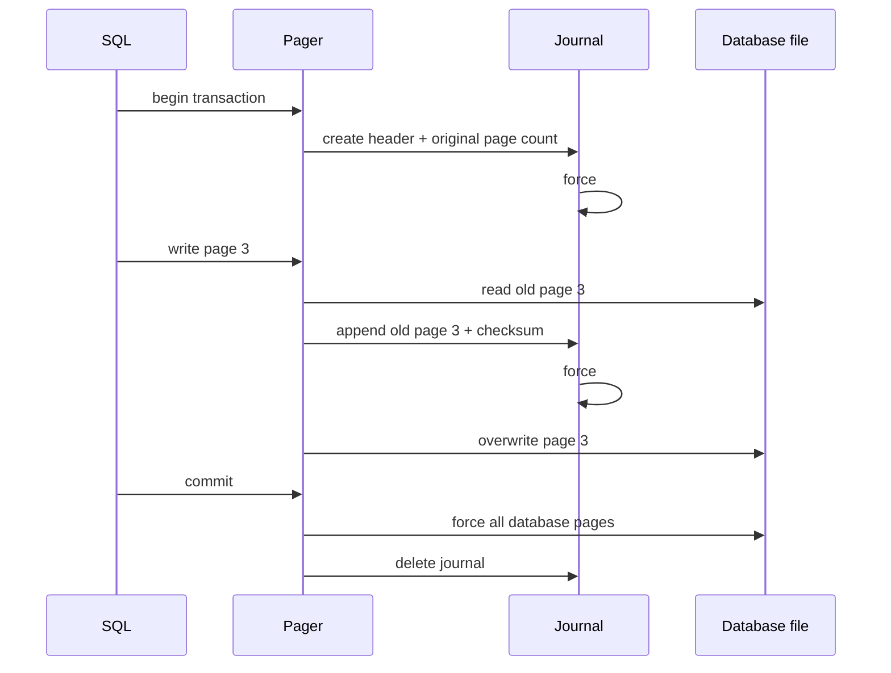
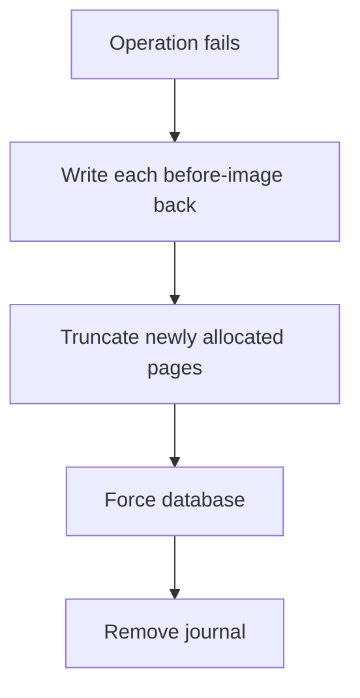
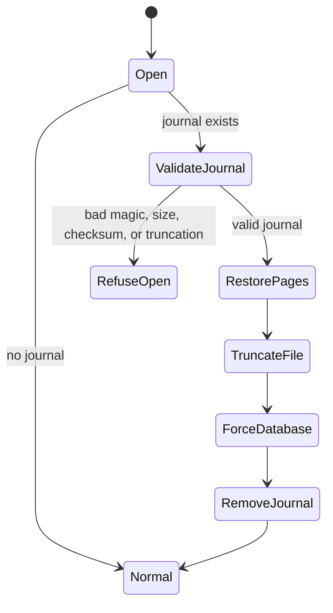

# 5. Transactions, Rollback Journals, and Recovery

> New words: **transaction**, **atomic**, **before-image**, **rollback journal**, **flush**, **commit**,
> **hot journal**, and **recovery**. Review [Database Foundations](00-database-foundations.md) if
> these are unfamiliar.

## The failure we must prevent

One SQL statement can change several pages. Imagine that page 1 is written, the process crashes,
and page 2 is still old:



Atomicity requires readers to see either `(A, B)` or `(A′, B′)`, never the mixture.

## Save before-images first

A **before-image** is the original page content. Before overwriting a page for the first time, save
its before-image to a sidecar rollback journal and force that journal to stable storage.



The ordering is the algorithm. If database bytes reach disk before their before-images, recovery
cannot reconstruct the old state.

## Journal format

The implementation uses a private teaching format:

```text
┌──────────┬─────────┬───────────┬────────────────────┬─────────────┐
│ magic    │ version │ page size │ original page count│ image count │
└──────────┴─────────┴───────────┴────────────────────┴─────────────┘

repeated image:
┌─────────┬─────────────────┬──────────┐
│ page id │ page-size bytes │ CRC32    │
└─────────┴─────────────────┴──────────┘
```

The original page count matters when a failed transaction allocated new pages. Rollback restores
old pages and truncates the database to its original length. The checksum detects corrupted journal
images rather than copying corruption into the database.

## Exactly-once capture

A transaction may update the same page many times. Only its first old value is useful:

```text
page 3: A → B → C → D
         ▲
         journal stores A once
```

`RollbackJournal` tracks captured page ids. Every later write to page 3 uses the already durable
before-image.

## Commit

Commit follows three ordered steps:

1. force the database channel;
2. clear in-memory transaction state;
3. delete the journal and attempt to force its directory entry.

Journal deletion is the commit marker. Before deletion, recovery chooses the old state. After
deletion, the new database state is authoritative.

## Immediate rollback

If an operation returns `Left`, the process is still alive and can roll back immediately:



If rollback itself fails, that storage error replaces the original operation error. Reporting the
original error while leaving uncertain recovery state would be misleading.

## Hot-journal recovery

A journal still present during open is **hot**: a writer did not complete commit cleanup. The pager
recovers it before validating or exposing database pages.



Never silently ignore a malformed hot journal. The database may contain half-written pages, so
opening it as normal risks returning corrupt data.

## SQL integration

The file backend wraps every mutating storage operation:

- `CREATE TABLE`: allocate root and add catalog entry in one pager transaction;
- multi-row `INSERT`: encode all rows first, then insert all records in one transaction;
- `DELETE`: build replacement records first, then rewrite the stable tree root in one transaction.

Semantic validation still happens before beginning the pager transaction. This keeps journals
small and ensures a `NOT NULL` error performs no file I/O.

## Declarative failure tests

The pager suite states observable invariants:

| Scenario | Required result |
|---|---|
| operation returns an injected error | original page restored |
| transaction allocated a new page | file truncated to old page count |
| successful commit | new bytes survive reopen and journal is absent |
| process “dies” after database overwrite | next open restores before-image |
| journal checksum or structure is invalid | refuse to open |

Run the focused suite:

```sh
scala-cli test . --test-only learnsqlite.storage.PagerSuite
```

## What this does not solve

The journal gives a single process a rollback protocol. It does not yet provide:

- file locks preventing two writers from racing;
- nested transactions or SQL `BEGIN`, `COMMIT`, and `ROLLBACK` statements;
- savepoints;
- write-ahead logging;
- a dirty-page cache that writes pages in an optimized order;
- exhaustive filesystem fault injection;
- byte compatibility with SQLite rollback journals.

Those limitations remain visible in the [Coverage Audit](coverage.md).

## Specification links

- [Atomic Commit In SQLite](https://www.sqlite.org/atomiccommit.html)
- [File Locking And Concurrency](https://www.sqlite.org/lockingv3.html)
- [Write-Ahead Logging](https://www.sqlite.org/wal.html)
