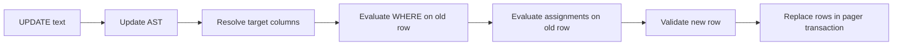
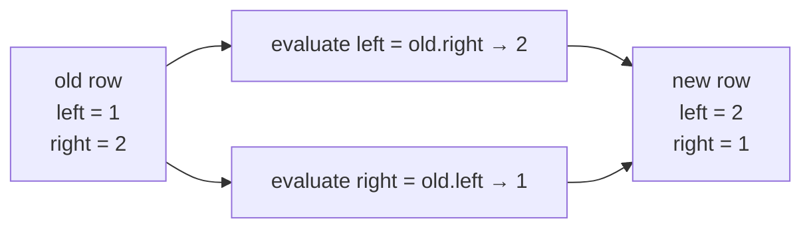
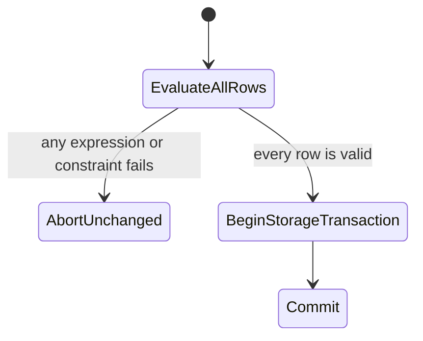

# 9. Implementing UPDATE End to End

`UPDATE` is the first statement in this book that reads old values and writes new values in one
operation:

```sql
UPDATE inventory
SET quantity = quantity + 5
WHERE id = 2;
```



## Grammar and typed representation

The supported grammar is:

```text
UPDATE table-name
SET column-name = expression [, column-name = expression ...]
[WHERE expression]
```

The AST keeps assignments ordered and typed:

```scala
case Update(
  table: Identifier,
  assignments: Vector[(Identifier, Expr)],
  where: Option[Expr]
)
```

The parser first consumes the table and `SET`, then reuses `commaSeparated` for assignments and the
existing expression parser for right-hand sides. `WHERE` is optional through the same helper used
by `SELECT` and `DELETE`.

Reference: [SQLite UPDATE](https://www.sqlite.org/lang_update.html).

## Resolve names before touching rows

Two different names occur in an assignment:

```sql
SET quantity = quantity + bonus
    └ target    └──── expression columns
```

The target must resolve to a schema position. Every column inside the expression must also resolve.
Doing this before reading rows ensures an empty table still reports `no such column`.

A target may appear only once:

```sql
UPDATE users SET id = 1, id = 2;
```

The implementation rejects this instead of inventing a left-to-right precedence rule.

## Assignments are simultaneous

SQL assignments observe the original row. This statement swaps two columns:

```sql
UPDATE pairs
SET left_value = right_value,
    right_value = left_value;
```



Mutating an array after each expression would incorrectly produce `(2, 2)`. The executor first
evaluates every expression against the immutable old `Row`, collects `(Column, Value)` pairs, and
only then writes them into a new array.

## WHERE and affected-row count

`WHERE` uses SQLite-style three-valued truth:

- true: update the row;
- false: preserve it;
- NULL/unknown: preserve it.

The result count is the number of matched rows, even when an assigned value happens to equal its old
value. This matches the executor's notion of rows affected by the statement.

## Validate the whole result before storage

Every changed value vector passes through `Row.checked`. A `NOT NULL` violation returns an error.
The executor builds decisions for **all** rows before calling `StoredTable.replace`, so a failure in
the last row cannot leave earlier rows updated.



For a file backend, replacement runs inside the rollback-journal transaction from Chapter 5. This
adds crash recovery to semantic all-or-nothing validation.

## Declarative tests

The tests cover three boundaries:

| Layer | Cases |
|---|---|
| Parser | multiple assignments and `WHERE` |
| Executor | simultaneous swap, unknown target, duplicate target, unknown expression, NOT NULL |
| File backend | successful update survives reopen; failed update preserves every row |

Run focused suites:

```sh
scala-cli test . --test-only learnsqlite.sql.ParserSuite
scala-cli test . --test-only learnsqlite.engine.DatabaseSuite
scala-cli test . --test-only learnsqlite.storage.FileBackendSuite
```

## Current differences from full SQLite UPDATE

Not yet implemented:

- `UPDATE OR ROLLBACK|ABORT|FAIL|IGNORE|REPLACE`;
- `FROM` joins;
- `ORDER BY`, `LIMIT`, and `RETURNING`;
- triggers;
- index maintenance;
- affinity conversion before constraint checks.

These remain explicit in the [Coverage Audit](coverage.md).

