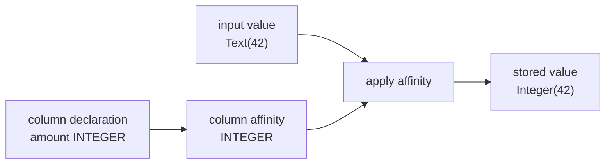

# 10. SQLite Type Affinity

Many databases attach one rigid type to each column. SQLite attaches a storage class to each value
and gives columns a **preference** called affinity.

```sql
CREATE TABLE example(amount INTEGER);
INSERT INTO example VALUES('42');
```

The SQL literal is TEXT, but INTEGER affinity stores it as integer 42 when conversion preserves the
value. If the text is `not-a-number`, SQLite keeps it as TEXT rather than rejecting the row.

Reference: [Datatypes In SQLite](https://www.sqlite.org/datatype3.html).

## Storage class and affinity are different



Storage class belongs to a value: NULL, INTEGER, REAL, TEXT, or BLOB. Affinity belongs to a column:
INTEGER, TEXT, REAL, NUMERIC, or BLOB.

## Derive affinity in the required order

SQLite examines the declared type as uppercase text. The first matching rule wins:

| Priority | Declared type contains | Affinity |
|---:|---|---|
| 1 | `INT` | INTEGER |
| 2 | `CHAR`, `CLOB`, or `TEXT` | TEXT |
| 3 | `BLOB`, or no declared type | BLOB |
| 4 | `REAL`, `FLOA`, or `DOUB` | REAL |
| 5 | anything else | NUMERIC |

Order matters. `CHARINT` contains both `CHAR` and `INT`, but INTEGER wins because it is rule 1.
`VARCHAR(20)` contains `CHAR`, so it has TEXT affinity. `BOOLEAN` matches none and becomes NUMERIC.

```scala
if name.contains("INT") then Integer
else if Vector("CHAR", "CLOB", "TEXT").exists(name.contains) then Text
else if name.contains("BLOB") then Blob
else if Vector("REAL", "FLOA", "DOUB").exists(name.contains) then Real
else Numeric
```

## Apply affinity at the storage boundary

Both INSERT and UPDATE eventually construct a candidate `Row`. `Row.checked` applies each column's
affinity before checking constraints and creating the immutable row.


Putting conversion here prevents memory and file backends from drifting. Decoded rows are checked
again, so persisted values pass the same schema boundary during reopen.

## TEXT affinity

TEXT affinity converts INTEGER and REAL values to their textual representation. NULL and BLOB stay
unchanged.

| Input | Stored |
|---|---|
| `Integer(500)` | `Text("500")` |
| `Real(500.5)` | `Text("500.5")` |
| `Text("500")` | unchanged |
| BLOB | unchanged |

Real rendering removes unnecessary trailing zeroes without using locale-dependent formatting.

## NUMERIC and INTEGER affinity

For storage, NUMERIC and INTEGER affinity use the same conversion:

1. well-formed integer text becomes INTEGER when it fits in 64 bits;
2. otherwise well-formed real text is parsed;
3. if the real value is exactly an in-range integer, store INTEGER;
4. otherwise store REAL;
5. text that is not a decimal numeric literal remains TEXT.

Examples:

| Input text | Stored value |
|---|---|
| `500` | `Integer(500)` |
| `500.0` | `Integer(500)` |
| `500.25` | `Real(500.25)` |
| `3.0e+5` | `Integer(300000)` |
| `0x10` | `Text("0x10")` |
| `hello` | `Text("hello")` |

`BigDecimal` checks whether decimal/scientific input is exactly integral before conversion. Using
only `Double` would lose information around large integer boundaries.

INTEGER and NUMERIC differ for some CAST expressions in full SQLite. CAST is not implemented yet,
so this milestone correctly shares their storage behavior.

## REAL affinity

REAL affinity converts INTEGER to REAL and numeric text to REAL:

```text
Integer(42)  → Real(42.0)
Text("42")   → Real(42.0)
Text("2.5")  → Real(2.5)
Text("hello") remains Text("hello")
```

Even when NUMERIC affinity would store `42.0` as an integer, REAL affinity keeps a real value.

## BLOB affinity

BLOB affinity performs no conversion. A missing declared type also produces BLOB affinity. “BLOB”
here means “no preferred conversion”; it does not require every stored value to be a binary blob.

## NULL and BLOB values

NULL and actual BLOB values are unaffected by every affinity. This rule is checked before the
affinity-specific cases.

## Declarative specification tests

`Affinity.test.scala` contains two tables of examples:

- ten declared-type cases, including ambiguous `CHARINT`;
- thirteen conversion cases covering every affinity and non-conversion behavior.

Integration tests reproduce the central SQLite documentation example:

```sql
CREATE TABLE affinity_values(
  as_text TEXT,
  as_numeric NUMERIC,
  as_integer INTEGER,
  as_real REAL,
  unchanged BLOB
);

INSERT INTO affinity_values
VALUES (500, '500.0', '500.0', '500.0', '500.0');
```

Expected storage classes are TEXT, INTEGER, INTEGER, REAL, and TEXT. A file-backed test closes and
reopens a row containing TEXT, NUMERIC, and REAL conversions to ensure record encoding preserves the
result.

Run focused tests:

```sh
scala-cli test . --test-only learnsqlite.core.AffinitySuite
scala-cli test . --test-only learnsqlite.engine.DatabaseSuite
scala-cli test . --test-only learnsqlite.storage.FileBackendSuite
```

## Remaining affinity work

This chapter implements affinity before storage. Full SQLite also applies affinity in comparisons,
compound SELECTs, and some expression contexts. Still missing:

- comparison operand affinity;
- expression affinity propagation;
- CAST;
- STRICT tables;
- affinity-aware index keys;
- exact SQLite numeric conversion edge behavior beyond the covered decimal grammar.

These distinctions remain visible in the [Coverage Audit](coverage.md).

