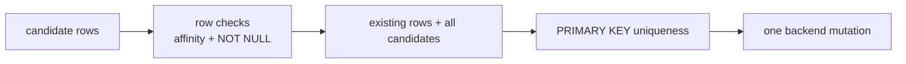
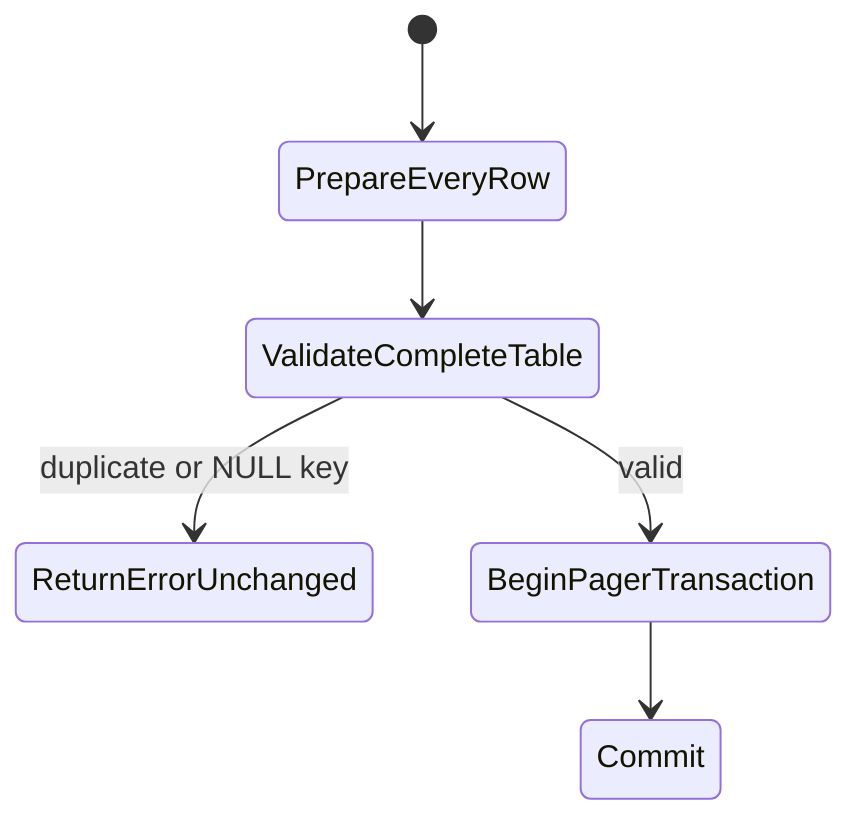
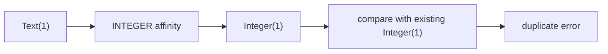

# 11. PRIMARY KEY as a Table-Wide Constraint

`NOT NULL` can be checked by looking at one row. `PRIMARY KEY` uniqueness cannot: a candidate key
must be compared with every row already in the table and every row in the same statement.



## Row-level versus table-level validation

`Row.checked` owns rules that need one row:

- correct number of values;
- storage affinity conversion;
- `NOT NULL`;
- PRIMARY KEY cannot be NULL in this milestone.

`Schema.validateRows` owns rules needing a complete proposed table:

- find the primary-key column;
- reject NULL;
- group values by content;
- reject any group containing more than one row.

Keeping the second check on `Schema` makes it shared by memory and file backends without teaching
the storage layer SQL constraint semantics.

## Validate the final state, not one value at a time

For INSERT, the proposed state is:

```text
existing rows ++ complete prepared batch
```

For UPDATE, it is:

```text
all rows after WHERE decisions and simultaneous assignments
```

Only after the complete state passes does the executor call `append` or `replace`.



This rejects a late conflict without appending a valid prefix from the same statement.

## Affinity runs before uniqueness

```sql
CREATE TABLE keyed(id INTEGER PRIMARY KEY);
INSERT INTO keyed VALUES(1);
INSERT INTO keyed VALUES('1');
```

The second value becomes `Integer(1)` through INTEGER affinity before uniqueness comparison, so it
conflicts with the first row.



Comparing raw input values would incorrectly permit both rows.

## BLOB equality is content-based

JVM arrays use reference equality by default. Two separately allocated arrays containing the same
bytes must still represent the same SQL BLOB key. Constraint grouping converts BLOBs to immutable
byte vectors for content-based equality.

## Declarative cases

The executor suite states these failures as a table:

| Scenario | Required result |
|---|---|
| NULL key | error; original rows unchanged |
| duplicate within one INSERT batch | error; no prefix appended |
| duplicate of an existing row | error |
| text key collides after INTEGER affinity | error |
| UPDATE changes key 2 to existing key 1 | error; both old rows remain |

The file-backed suite repeats INSERT and UPDATE conflicts, closes the database, reopens it, and
asserts the original rows are still present.

## Current SQLite differences

SQLite has historical edge behavior allowing NULL in some non-`INTEGER PRIMARY KEY` declarations
unless the table is `WITHOUT ROWID`, `STRICT`, or explicitly `NOT NULL`. This educational milestone
chooses the safer rule that every PRIMARY KEY is non-NULL.

Also not yet implemented:

- `INTEGER PRIMARY KEY` as an alias for the physical rowid;
- automatic rowid assignment for NULL;
- composite table-level primary keys;
- conflict policies such as `OR IGNORE` and `OR REPLACE`;
- UNIQUE constraints and unique indexes;
- foreign keys and deferred constraint checking.

These are tracked in the [Coverage Audit](coverage.md).

Reference: [SQLite CREATE TABLE constraints](https://www.sqlite.org/lang_createtable.html#constraints).

