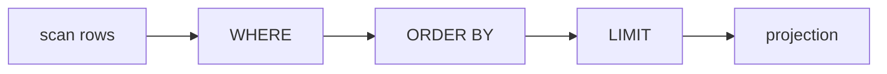
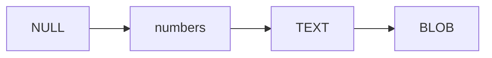
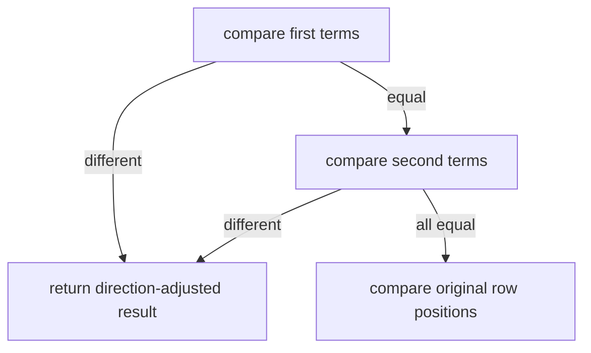

# 12. ORDER BY and LIMIT

Without `ORDER BY`, SQL does not promise a result order. A B-tree scan may look stable, but clients
must request the order they depend on.

```sql
SELECT name
FROM scores
ORDER BY score DESC, priority ASC
LIMIT 3;
```

## Pipeline position



This implementation evaluates sort expressions against source rows before projection. That permits
ordering by a column not included in the output. LIMIT runs after sorting; taking rows first would
sort only an arbitrary prefix.

## Typed ordering terms

```scala
enum SortDirection:
  case Ascending, Descending

final case class OrderingTerm(
  expression: Expr,
  direction: SortDirection
)
```

The parser accepts comma-separated terms with optional ASC or DESC. ASC is the default. LIMIT is a
non-negative integer in this milestone.

## Storage-class order

SQLite compares values for sorting by storage class:

```text
NULL < INTEGER/REAL < TEXT < BLOB
```

INTEGER and REAL compare numerically with each other. TEXT uses binary string ordering. BLOB uses
unsigned byte-by-byte ordering, followed by length when one value is a prefix of another.



Descending order negates each term's comparison. Later SQLite syntax can independently request
`NULLS FIRST` or `NULLS LAST`; that is not implemented yet.

## Decorate, sort, undecorate

Re-evaluating SQL expressions during every comparator call is wasteful and can obscure failures.
Evaluate sort keys once per row:

```text
(row, Vector(sortKey1, sortKey2), originalIndex)
```

Then compare keys from left to right. The first non-zero comparison wins. If all keys are equal,
compare `originalIndex` so the result preserves scan order deterministically.



## Resolve expressions before reading rows

Sort expressions use the same `validate` pass as projected expressions. Therefore:

```sql
SELECT * FROM empty_table ORDER BY missing;
```

fails even when the table has no rows. Deferring name lookup until expression evaluation would
incorrectly hide the error.

## Declarative tests

Tests cover:

- multiple sort terms with opposite directions;
- numeric equality between affinity-produced INTEGER and REAL values;
- NULL ordering;
- LIMIT after sorting;
- unknown sort columns on an empty table;
- sorting rows decoded after file reopen.

Run:

```sh
scala-cli test . --test-only learnsqlite.engine.DatabaseSuite
scala-cli test . --test-only learnsqlite.storage.FileBackendSuite
```

## Remaining sorting work

- `LIMIT offset, count` and `OFFSET`;
- ordering by output aliases and ordinal positions;
- `COLLATE` and user-defined collations;
- `NULLS FIRST` / `NULLS LAST`;
- index-assisted ordering without materializing every row;
- external sorting when results exceed memory.

Reference: [SQLite SELECT — ORDER BY](https://www.sqlite.org/lang_select.html#orderby).

