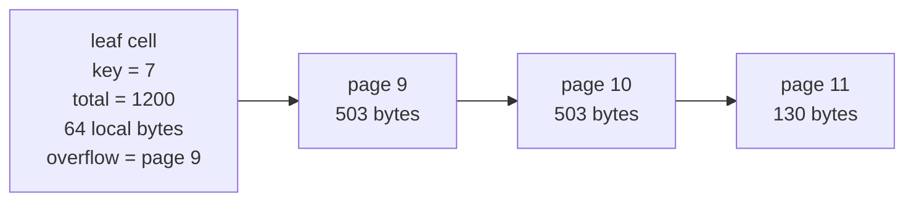
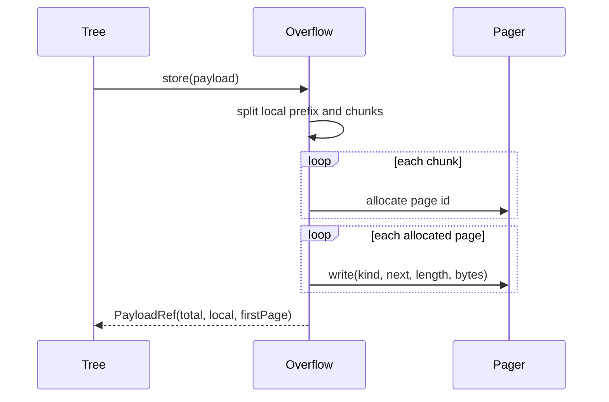
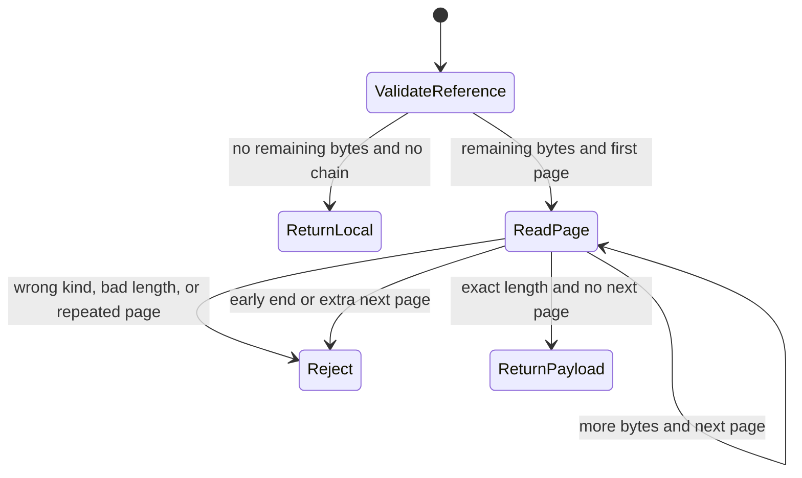

# 13. Storing Large Records with Overflow Pages

A B+tree leaf page must hold several cells and routing metadata. A 6,000-byte document cannot fit in
a 512-byte or 4,096-byte page. Rejecting it makes the database impractical; putting it directly in
the leaf breaks fixed-size page I/O.

The solution is to keep a small prefix in the leaf and chain the remainder through overflow pages.

Reference: [Cell Payload Overflow Pages](https://www.sqlite.org/fileformat.html#cell_payload_overflow_pages).

## Leaf cell representation

```text
leaf cell
┌───────┬──────────────┬──────────────┬────────────────┬──────────────┐
│ key   │ total length │ local length │ first overflow │ local bytes  │
└───────┴──────────────┴──────────────┴────────────────┴──────────────┘
```

The private format keeps at most 64 bytes locally. A payload at or below that limit needs no
overflow page.



Each overflow page stores:

```text
┌──────┬───────────┬──────────────┬──────────────────┐
│ kind │ next page │ chunk length │ chunk bytes      │
└──────┴───────────┴──────────────┴──────────────────┘
```

With a 512-byte page and a 9-byte header, one page carries 503 payload bytes.

## Writing a chain

`OverflowPages.store` performs four steps:

1. clone caller bytes so later mutation cannot affect storage;
2. take the local prefix;
3. divide remaining bytes into page-capacity chunks;
4. allocate all page ids, then write each page with its next pointer.



Allocation occurs inside the file backend's pager transaction. A failed statement truncates all new
overflow pages back to the original file length.

## Reconstructing a payload

Start with local bytes, then follow the chain until the declared total length is reached. Loading
validates every step:

- local length cannot exceed total length;
- remaining bytes require a first overflow page;
- an overflow page must use the overflow kind;
- chunk length must be positive and fit the page;
- page ids may not repeat;
- accumulated bytes may not exceed total length;
- the chain must end exactly at total length.



Cycle detection uses a set of visited page ids. A corrupt `9 → 10 → 9` chain returns an error rather
than looping forever.

## B+tree integration

The B+tree stores `Cell(key, PayloadRef)` rather than raw payload arrays. Page-size calculations use
only the fixed cell header and local bytes, so a 6,000-byte value does not make its leaf enormous.

`get` and `scan` materialize payloads through `OverflowPages.load`. Callers still receive the same
API—`Array[Byte]` payloads—without knowing whether bytes were local or overflowed.

## Boundary tests

Declarative cases cover:

| Payload size | Expected shape |
|---:|---|
| 0, 1, 63, 64 | local only |
| 65 | local plus one overflow page |
| 503, 504 | boundaries around one overflow chunk after local prefix |
| 1,070 | multiple overflow pages |
| 4,096 | many pages and B+tree reopen |
| 6,000-character SQL TEXT | record codec + B+tree + pager + reopen |

Corruption cases modify on-disk pages to create a wrong kind, impossible chunk length, short chain,
and cycle. Rollback tests ensure allocated pages disappear after an injected transaction error.

Run:

```sh
scala-cli test . --test-only learnsqlite.storage.OverflowPagesSuite
scala-cli test . --test-only learnsqlite.storage.TableBTreeSuite
scala-cli test . --test-only learnsqlite.storage.FileBackendSuite
```

## Remaining space-management work

Replaced or deleted overflow chains are reclaimed by the private freelist described in
[14. Reusing Pages After UPDATE and DELETE](14-free-page-reuse.md). Exact SQLite compatibility still
requires its payload-fraction formulas instead of this fixed 64-byte local prefix.

See the [Coverage Audit](coverage.md).
