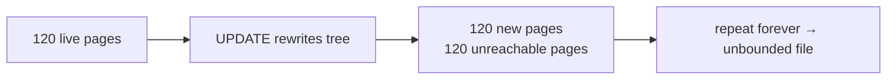
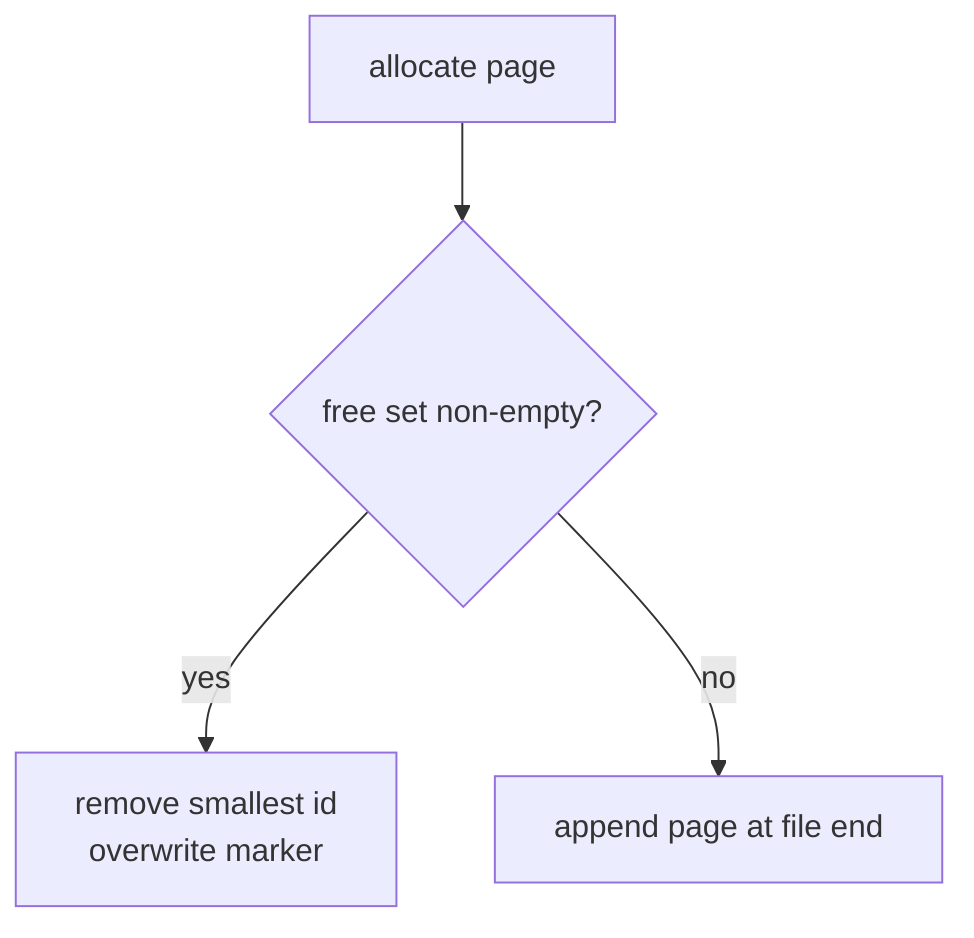
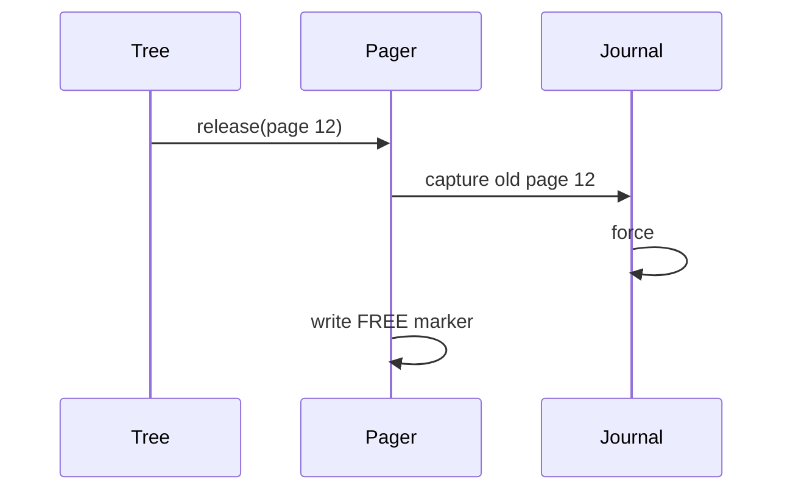
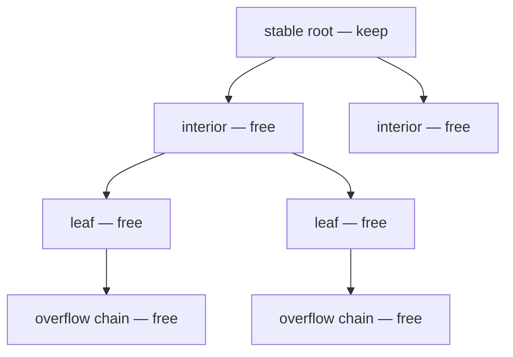
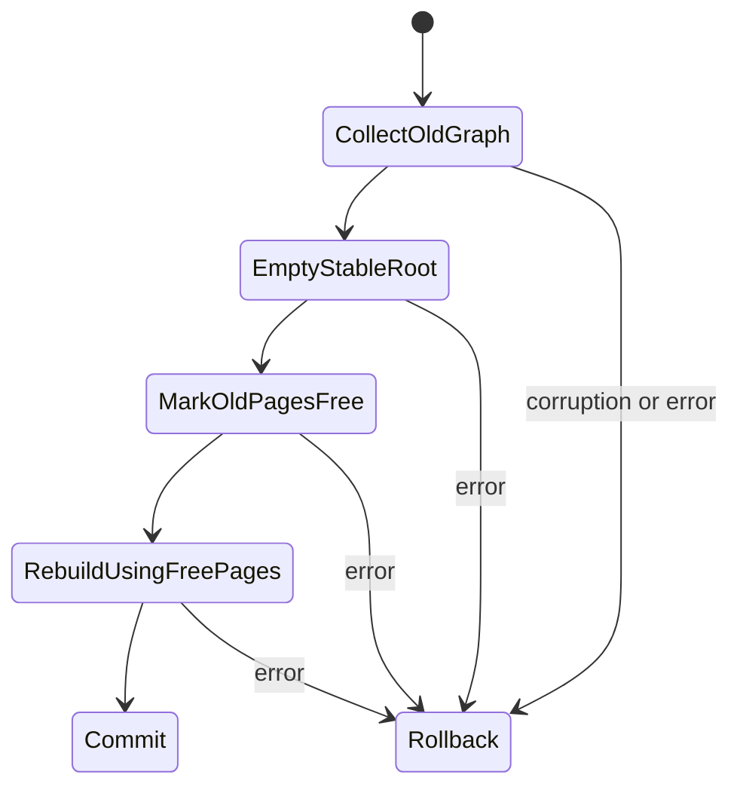

# 14. Reusing Pages After UPDATE and DELETE

Deleting logical rows is not enough. If their old leaf, interior, and overflow pages remain
unreachable forever, the file grows after every UPDATE even when the amount of live data is stable.



A **freelist** records pages that no live structure references and makes them available to future
allocations.

Reference: [SQLite Freelist](https://www.sqlite.org/fileformat.html#the_freelist).

## Private teaching representation

SQLite stores a freelist head and count in the database header, with trunk pages pointing to many
free leaves. This project first implements the same lifecycle invariant with a simpler marker:

```text
free page
┌───────────────┬──────────────────────────────────────┐
│ kind = FREE   │ zero-filled remainder               │
└───────────────┴──────────────────────────────────────┘
```

On open, the pager scans page kinds once and builds an in-memory ordered set of free page ids. An
allocation takes the smallest free id before extending the file.



The scan is not SQLite-compatible and costs one pass during the first allocation after open. A
future format-compatibility milestone will replace it with header/trunk metadata.

## Why release belongs to the pager

`Pager.release(pageId)` validates that the page exists and is not already free, then writes the
free marker as a normal full-page write. This has an important consequence: active rollback
transactions capture the old used page before the marker is written.



If the transaction aborts, journal recovery restores page 12's old bytes. If a free page was reused
during the failed transaction, recovery restores its FREE marker. Both directions are atomic.

## Proving that a page is obsolete

The pager cannot decide whether a page is still referenced. The B+tree owns that graph and must
enumerate it before release.



`ownedPages` recursively walks:

1. interior children;
2. leaf pages;
3. every leaf cell's validated overflow chain.

The stable catalog root is excluded. Corrupt overflow chains fail the operation before release,
instead of freeing an uncertain set of pages.

## Replacement sequence

The current DELETE and UPDATE backend rewrites complete table contents. Replacement now performs:

1. validate and collect every obsolete descendant/overflow page;
2. overwrite the stable root as an empty leaf;
3. mark collected pages free;
4. insert replacement rows;
5. commit the pager transaction.

New insertions immediately reuse pages released in step 3.



## Bounded-growth test

The test creates 80 rows with 900-byte payloads, requiring more than 100 pages. It records this
high-water mark, replaces the tree with 10 rows, and verifies more than 100 pages become free. It
then restores 80 rows with different payloads.

Required invariant:

```text
pageCount after regrowth == original high-water pageCount
```

The file is closed and reopened to prove reused content remains reachable.

Pager-level tests additionally cover:

- free page survives reopen;
- allocation returns the free page rather than extending the file;
- double release is rejected without changing the set;
- rollback restores a reused free page and a newly freed used page.

Run:

```sh
scala-cli test . --test-only learnsqlite.storage.PagerSuite
scala-cli test . --test-only learnsqlite.storage.TableBTreeSuite
```

## Remaining deletion work

Full-tree replacement is correct but expensive. A mature B+tree should delete one cell, borrow or
merge underfull siblings, update parent separators, and release only pages that become empty.

Still missing:

- cell-level deletion;
- sibling borrow/merge and root height reduction;
- SQLite-compatible freelist trunk and header count;
- tail-page truncation when the highest pages are free;
- vacuum and incremental vacuum;
- free-page secure deletion policy.

Track these in the [Coverage Audit](coverage.md).

