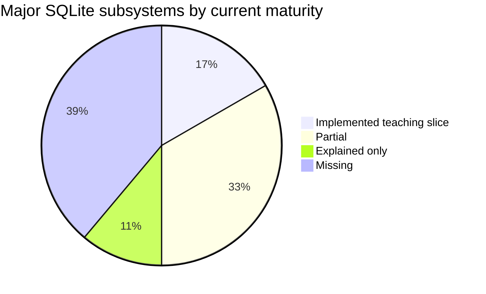

# Coverage Audit

This page answers “is the project comprehensive?” with evidence instead of impression.

## Status vocabulary

| Status | Meaning |
|---|---|
| ✅ Implemented | Usable through the public SQL or storage path, tested, and explained. |
| 🟡 Partial | A teaching subset works, but important specification behavior is missing. |
| 📖 Explained | The concept is documented but production code is not present. |
| ⬜ Missing | Neither adequate implementation nor a complete chapter exists yet. |

“Implemented” never means “identical to SQLite” unless the compatibility column says so.

## Executive assessment

The project is comprehensive as a **map** after this audit, but not yet comprehensive as an
**implementation**. It is a restart-persistent, rollback-journaled single-process database with a
small SQL language and private page format. It is not a drop-in SQLite replacement.

## SQL language

Reference: [SQLite SQL Language](https://www.sqlite.org/lang.html)

| Feature | Code | Tests | Chapter | Status |
|---|---|---|---|---|
| Positioned tokens and comments | `Lexer.scala` | `Parser.test.scala` | Chapter 1 | ✅ |
| Quoted identifiers and string escaping | `Lexer.scala` | `Parser.test.scala` | Chapter 1 | 🟡 only double quotes and SQL strings |
| `CREATE TABLE` | `Parser.scala`, `Database.scala` | parser/database/file suites | Chapters 1, 8 | 🟡 column subset only |
| `INSERT ... VALUES` | parser/database | database/file suites | Chapters 1, 8 | 🟡 no SELECT source/upsert/default |
| `SELECT` projection and `WHERE` | parser/evaluator | database suite | Chapters 1, 2 | 🟡 one table only |
| `DELETE` and `WHERE` | parser/database | database/file suites | Chapters 1, 8 | 🟡 no order/limit/returning |
| Operator precedence | `Parser.scala` | parser suite | Chapter 1 | 🟡 arithmetic/comparison/boolean subset |
| `UPDATE ... SET ... WHERE` | parser/database/file backend | parser/semantic/reopen suites | Chapter 9 | 🟡 core subset |
| `DROP` / `ALTER` | — | — | roadmap mention | ⬜ |
| Joins and subqueries | — | — | roadmap mention | ⬜ |
| Grouping and aggregates | — | — | roadmap mention | ⬜ |
| Ordering, limit, compound select | — | — | — | ⬜ |
| CTEs, windows, triggers, views | — | — | — | ⬜ |
| Pragmas and attach | — | — | — | ⬜ |

## Values and SQL semantics

Reference: [Datatypes In SQLite](https://www.sqlite.org/datatype3.html)

| Feature | Evidence | Status |
|---|---|---|
| NULL, INTEGER, REAL, TEXT, BLOB | `Value.scala`, record round trips | ✅ |
| Three-valued boolean logic | `Truth`, predicate tests | ✅ |
| Arithmetic and comparisons | `Evaluator.scala` | 🟡 limited coercion |
| `NOT NULL` | schema and persistent batch tests | ✅ |
| Declared types retained | catalog records | ✅ |
| SQLite type affinity | — | ⬜ |
| Collations | binary text comparison only | 🟡 |
| `INTEGER PRIMARY KEY` rowid alias | parsed but not honored | ⬜ |
| UNIQUE, CHECK, DEFAULT, FOREIGN KEY | — | ⬜ |
| Date/time and JSON functions | — | ⬜ |

## Record and file representation

Reference: [Database File Format](https://www.sqlite.org/fileformat.html)

| Feature | Evidence | Compatibility | Status |
|---|---|---|---|
| 1–9 byte varints | `Varint.scala`, boundary table | SQLite-compatible | ✅ |
| Record header fixed point | `RecordCodec.scala` | SQLite-compatible | ✅ |
| Serial types 0–9 and 12+ | codec and corruption tests | SQLite-compatible | ✅ |
| UTF-8 text records | strict decoder | SQLite-compatible subset | ✅ |
| Database header | `Pager.scala` | private LSQL format | 🟡 |
| B-tree page header/cells | `TableBTree.scala` | private format | 🟡 |
| Page-1 100-byte header | — | none | ⬜ |
| Payload fractions/overflow | — | none | ⬜ |
| Freelist trunk/leaves | — | none | ⬜ |
| Pointer-map pages/autovacuum | — | none | ⬜ |

## B-tree and access methods

Reference: [B-tree Pages](https://www.sqlite.org/fileformat.html#b_tree_pages)

| Feature | Evidence | Status |
|---|---|---|
| Ordered table leaf entries | `TableBTree.scala` | ✅ |
| Leaf split and linked scan | reverse insertion/reopen test | ✅ |
| Multiple stable roots | catalog and isolation test | ✅ |
| Defensive payload copying | alias-mutation test | ✅ |
| Interior nodes | `TableBTree.Interior`, 1,500-key tests | ✅ |
| Recursive split propagation | leaf/interior/root split protocol | ✅ |
| Cell deletion/rebalancing | full-tree rewrite only | ⬜ |
| Index B-tree | — | ⬜ |
| Logarithmic lookup | recursive separator descent | ✅ |

## Transactions and recovery

References: [Atomic Commit](https://www.sqlite.org/atomiccommit.html),
[Locking](https://www.sqlite.org/lockingv3.html), [WAL](https://www.sqlite.org/wal.html)

| Feature | Evidence | Status |
|---|---|---|
| Validate a multi-row statement before writing | persistent invalid-batch test | ✅ |
| Before-image rollback journal | `RollbackJournal.scala` | ✅ private format |
| Journal forced before page overwrite | journal `FileDescriptor.sync` in `capture` | ✅ |
| Database forced before journal removal | `Pager.transaction` | ✅ |
| Immediate rollback on operation error | pager failure test | ✅ |
| Hot-journal recovery on open | crash-simulation reopen test | ✅ |
| Remove newly allocated pages on rollback | original page-count truncation test | ✅ |
| Checksummed journal records | CRC validation | ✅ |
| Nested transactions/savepoints | explicitly rejected | ⬜ |
| Multi-process file locks | — | ⬜ |
| Busy timeout | — | ⬜ |
| WAL and checkpointing | — | ⬜ |
| Filesystem fault matrix | three deterministic points only | 🟡 |

## Catalog and schema

| Feature | Evidence | Status |
|---|---|---|
| Persistent multiple table schemas | `Catalog.scala` and reopen test | ✅ |
| Case-insensitive lookup | identifier normalization tests | ✅ |
| Stable table root pages | multi-root test | ✅ |
| Catalog corruption rejected | malformed shape test | ✅ |
| Original CREATE SQL | structured columns stored instead | 🟡 differs from SQLite |
| Index/trigger/view entries | — | ⬜ |
| Schema version/cache invalidation | — | ⬜ |

## Query compilation and performance

Reference: [Query Planning](https://www.sqlite.org/queryplanner.html)

| Feature | Status |
|---|---|
| Direct AST interpreter | ✅ |
| Early column-name validation | ✅ |
| Streaming table cursor | ⬜ rows are materialized |
| Logical/physical plans | ⬜ |
| Bytecode virtual machine | ⬜ |
| Cost model and statistics | ⬜ |
| Index selection | ⬜ |
| `EXPLAIN` | ⬜ |

## Concurrency, API, and operations

| Feature | Status |
|---|---|
| Single handle and explicit close | ✅ |
| REPL over a persistent file | ✅ |
| Two concurrent readers | ⬜ no locking contract |
| Concurrent writer exclusion | ⬜ |
| JDBC | ⬜ |
| Prepared statements/bind parameters | ⬜ |
| Backup API | ⬜ |
| Online integrity check | ⬜ |
| Metrics and tracing | ⬜ |

## Documentation completeness

| Requirement | Current evidence | Status |
|---|---|---|
| Beginner prerequisites | Chapter 0 | ✅ |
| Searchable terminology | glossary | ✅ |
| System overview diagrams | Chapters 0 and architecture | ✅ |
| Implemented subsystem walkthroughs | Chapters 1–8 | 🟡 older chapters 2–5 need more depth |
| Specification links | chapters and Scaladoc | ✅ for implemented formats |
| Every unsupported behavior named | this audit covers major areas | 🟡 edge SQL grammar remains huge |
| Reproducible chapter checkpoints | focused test commands in newer chapters | 🟡 |
| Per-milestone source snapshots | Git history only | ⬜ |

## Exit criteria for “comprehensive SQLite implementation”

The project may call itself comprehensive only after:

1. every ⬜ row above becomes implemented or an explicit permanent non-goal;
2. private storage pages are either SQLite-compatible or the product name clearly stops claiming
   SQLite compatibility;
3. differential SQL tests compare supported semantics with the `sqlite3` executable;
4. generated corrupt files and crash points are exercised automatically;
5. concurrent access has a documented and enforced locking model;
6. the book has a runnable checkpoint and exercises for each subsystem.

Until then, README and release notes must state the narrower achieved milestone.
